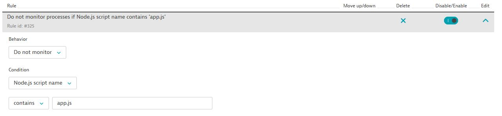
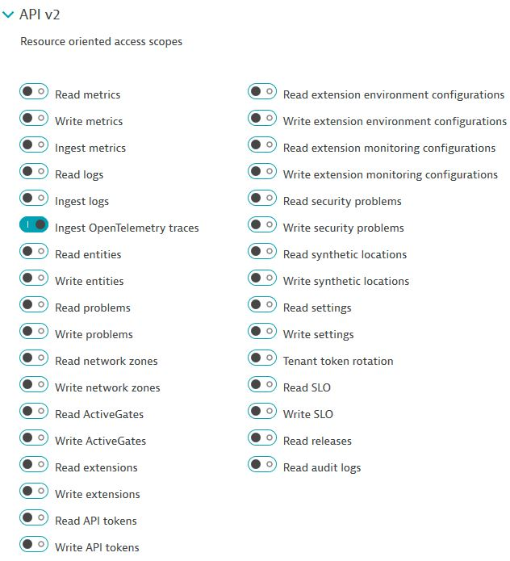

# OpenTelemetry Hands-On Workshop
**Note:** Replace **YOURNAME** with your name (ex. johnsmith) must be lowercase
```$xslt
export INSTANCE_NAME=YOURNAME
```

```$xslt
gcloud beta compute --project=sales-engineering-noram instances create $INSTANCE_NAME --zone=us-central1-a --machine-type=e2-medium --subnet=default --network-tier=PREMIUM --maintenance-policy=MIGRATE --service-account=670246978281-compute@developer.gserviceaccount.com --scopes=https://www.googleapis.com/auth/devstorage.read_only,https://www.googleapis.com/auth/logging.write,https://www.googleapis.com/auth/monitoring.write,https://www.googleapis.com/auth/servicecontrol,https://www.googleapis.com/auth/service.management.readonly,https://www.googleapis.com/auth/trace.append --tags=http-server,https-server --image=ubuntu-2004-focal-v20210720 --image-project=ubuntu-os-cloud --boot-disk-size=10GB --boot-disk-type=pd-balanced --boot-disk-device-name=wmsoteltest --no-shielded-secure-boot --shielded-vtpm --shielded-integrity-monitoring --reservation-affinity=any
```

Navigate to Compute Engine and find your instance name and click the SSH button to open a new popup terminal window.

Once successfully connected to your VM, clone the GitHub repository:
```$xslt
git clone https://github.com/SEBootcamp/OpenTel.git
```

Navigate into the downloaded OpenTel directory
```$xslt
cd ~/OpenTel
```

Execute the setupenv.sh script to download a few dependencies we'll need.
```$xslt
./setupenv.sh
```
## OneAgent Instrumentation
First thing we need to do is install a OneAgent on our VM. **Note:** The Dynatrace Cluster version must be min. 1.222 in order for Trace Ingest to be available.

After the OneAgent is installed we need to make the following changes in Dynatrace:
1. **Enable OpenTelemetry for Java**<br />
   Settings > Server-side service monitoring > Deep monitoring > OpenTelemetry and OpenTracing
   
2. **Enable W3C TraceContext**<br />
   Settings > Server-side service monitoring > Deep monitoring > Distributed tracing
   
   
Back in the SSH Terminal navigate to the "OneAgent_Instrumentation" directory
```$xslt
cd OneAgent_Instrumentation
```
Execute the startup.sh script to startup our sample OpenTelemetry Java application
```$xslt
./startup.sh
```
Within a few minutes two different Java processes should show up in Dynatrace (Client and Server).
We will then be able to check the PurePaths and see the OpenTelemetry instrumentation done by the OneAgent.

## Trace Ingest
In this section we will setup an application that already has OpenTelmetry but will NOT be instrumented with the OneAgent. 
We will use the Trace Ingest API to send the traces/spans to Dynatrace.
1. **Disable OneAgent Instrumentation<br />**
Navigate to Settings > Processes and containers > Process group monitoring > Process monitoring rules
Add the following rule:


2. **Create an API Token<br />**
Navigate to Settings > Integration > Dynatrace API
Generate a new API Token with the **Ingest OpenTelemetry traces** permission
<br />
**Ensure you copy this token, since we only see it once at creation**

3. Navigate back to the SSH Terminal and open the folder "TraceIngest"
    ```$xslt
    cd ~/OpenTel/TraceIngest
    ```
4. We need to install our Node.js application by running the following command:
    ```$xslt
    npm install
    ```
5. Now we need to add our Dynatrace credentials to the **config.js** file
    ```$xslt
    nano config.js
    ```
6. In the config.js file where it says <TENANT_ID> with your tenant id (ex. ``abc12345``)
and replace <API_TOKEN> with your API Token (ex. ``dt0c01.ST2EY72KQINMH574WMNVI7YN.G3DFPBEJYMODIDAEX454M7YWBUVEFOWKPRVMWFASS64NFH52PX6BNDVFFM572RZM``)

7. We need to put a web server in front of our application, for that we will use Nginx which has already been installed and should be running.  We will just need
to reverse proxy the traffic from Nginx to our sample Node.js application.  First we'll remove the default configuration:
    ```
    sudo rm /etc/nginx/sites-enabled/default
   ```
8. Now we will create a new file where we will add our configuration:
    ```$xslt
    sudo nano /etc/nginx/sites-available/node
    ```
9. Past the following code in the file.  This will forward all requests coming in to Nginx on port 80 to our Node.js application listening on port 8080
    ```$xslt
    server {
        listen 80;
        server_name example.com;
    
        location / {
            proxy_set_header   X-Forwarded-For $remote_addr;
            proxy_set_header   Host $http_host;
            proxy_pass         "http://127.0.0.1:9000";
        }
    }
    ``` 
   save the file when finished.
  
10. Let's add our new configuration to Nginx:
    ```$xslt
    sudo ln -s /etc/nginx/sites-available/node /etc/nginx/sites-enabled/node
    ```
11. Finally we'll restart Nginx to apply the changes
    ```$xslt
    sudo service nginx restart
    ```
12. We can now start our application:
    ```$xslt
    ./startup.sh
    ```
13. You should now be able to pull our sample application in a web browser by navigating to
    ```$xslt
    http://<YOUR_HOST_IP>
    ``` 
    Note: You can find your host IP Address in the GCP console
